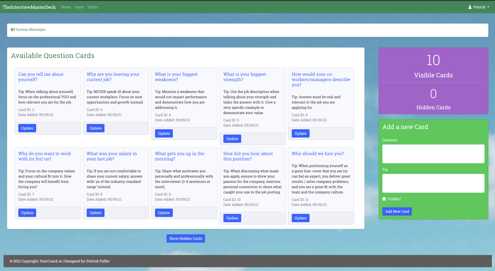
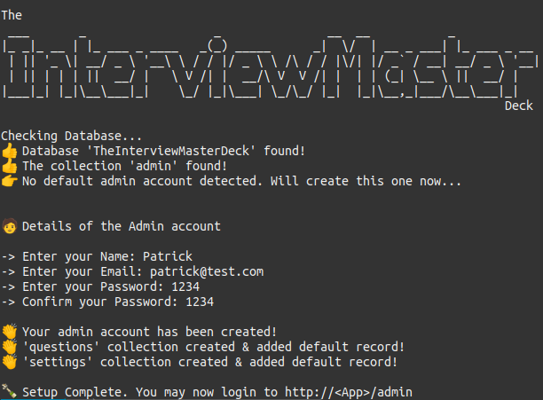
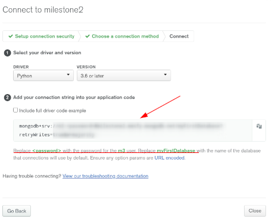
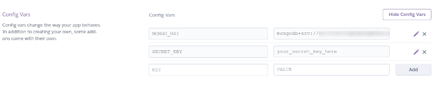

Milestone 3 submission for [Code Insitute](https://codeinstitute.net)

---

<br><br>


# The Interview Master Deck

<p align="center"> 

</p>

## On-the-go app to help you prepare for most common interview questions

<br>

---

<br>

## Features

- Front-end app for your end users
  - Mobile app with swipe functionality to easily navigate trough cards
  - Instructions to help end users consume the cards
  - Search by keyword functionality
  - Search results can easily be linked or bookmarked
- Admin Portal for Settings & Cards Management
  - Separate portal for admin to login
  - Card Management system to allow admin to easily delete, modify or add new cards
  - Ability to modify instructions with Markdown and HTML syntax

<br>

## Preview:

- Admin Panel  
  

- User App  
   
  

- Installer  
   

<br><br>

## Technologies Used

This application has been built by using the following technologies:

- [HTML 5](https://www.w3.org/TR/2008/WD-html5-20080122/) / [CSS](https://www.w3.org/Style/CSS/Overview.en.html) / [JavaScript](https://262.ecma-international.org/10.0/index.html)
- [JQuery](https://jquery.com)
  - Simplified DOM manipulation.
- [Font Awesome](https://fontawesome.com/)
  - Iconic SVG, font, and CSS framework.
- [Bootstrap](https://getbootstrap.com/)
  - Front-end framework for web development.
- [Swiper JS](https://swiperjs.com/)
  - Javascript API to enable navigation by swipe
- [Python](https://www.python.org/)
  - Python is a programming language that lets you work quickly
    and integrate systems more effectively
- Python Extensions:
  - [Python-Markdown](https://python-markdown.github.io/)
    - Python implementation of John Gruber’s Markdown.
  - [Python Flask](https://flask.palletsprojects.com/)
    - Flask is a lightweight WSGI web application framework.
  - [DNSPython](https://www.dnspython.org/)
    - Dnspython is a DNS toolkit for Python. It can be used for queries, zone transfers, dynamic updates, nameserver testing, and many other things.
  - [PyMongo](https://pymongo.readthedocs.io/)
    - PyMongo is a Python distribution containing tools for working with MongoDB, and is the recommended way to work with MongoDB from Python.
  - [PIP3](https://pypi.org/) - The Python Package Index (PyPI) is a repository of software for the Python programming language.
    <br><br>

## Development

If you are curious about the process of the development of this project, please [click here](./documentation/development.md).
<br><br>

## Deployment

### Demo

- End User live demo available at https://the-interview-master-deck.herokuapp.com/
- Admin Portal live demo available at https://the-interview-master-deck.herokuapp.com/admin (username: admin@admin.com, password: SuperSecret123!)

### Requirements

- A host capable to run python3 applications and PIP3, with internet access
  - Example: https://www.heroku.com/
- A host capable to run MongoDB with internet access
  - Example: https://www.mongodb.com/

### Steps

- Database Server (Steps for MongoDB.com but consult with your host/provider for proper documentation)
  1. [Create a database cluster](https://docs.atlas.mongodb.com/getting-started/)
  2. [Create a user for your cluster](https://docs.atlas.mongodb.com/tutorial/create-mongodb-user-for-cluster/)
     1. navigate to **Database Access** under _Security_ menu
     2. SCRAM username and password should only be **alphanumeric** _(no special characters!)_
     3. select **Read and Write to any Database** from _Database User Privileges_
  3. Whitelist your IP
     1. navigate to **Network Access** under _Security_ menu
     2. select **Allow Access From Anywhere**
     3. _supply IP Addresses of actual hosts further security_
  4. [Create a database called 'TheInterviewMasterDeck', together with your first collection called 'admin'](https://docs.atlas.mongodb.com/tutorial/insert-data-into-your-cluster/)
     1. - select **Add My Own Data** from the _Collections_ tab on your Cluster Sandbox
  5. Navigate back to your cluster and click on 'connect' then 'connect your application'
  6. Ensure Python is selected as your driver with version 3.6
  7. Note your connection string, you will require to set this up in your environment variables at the App Server. 
- Application Server (Steps for Heroku.com but consult with your host/provider for proper documentation)
  1. [Review official documentation for steps](https://devcenter.heroku.com/articles/getting-started-with-python)
  2. Add the necessary environment variables to Heroku
     1. Go to Heroku Settings Tab
     2. Click Reveal Config Vars
     3. Add the following: MONGO_URI = <Mongo URI, which you have noted earlier in MongoDB>
     4. Add a new variable: SECRET_KEY = <create your own key, for testing secret-key is enough>
     - Example: 
  3. Deploy the App directly from this github or a fork:
     1. Go to the Deploy Tab
     2. Click GitHub for Deployment Method
     3. Click Connect to GitHub
     4. Provide your GitHub repository name, then click Search (example: https://github.com/patrickpulfer/code_insitute_m3)
     5. Click Deploy Branch on Heroku
  4. Run the initial setup app: `python3 initial_setup.py` and create your admin credentials
- Local Installation (assuming your have python3 and pip3 installed on your machine; if not, install it now!)
  1. You may deploy the repo locally. The follow instructions below are for a linux machine
  2. Create a folder where you want the App to reside and navigate to it in your command line
  3. Clone the App from Github:
  ```bash
  git init
  git clone https://github.com/patrickpulfer/code_insitute_m3.git .
  ```
  4. Create an environment variable file called env.py and add the following:
  ```python
  import os
  os.environ.setdefault("SECRET_KEY", "<your_secret_key_here>")
  os.environ.setdefault(
    "MONGO_URI", "<YOUR MONGO DB URI YOU HAVE NOTED EARLIER>")
  ```
  5. Install dependencies with PIP3:
  ```bash
  pip3 install -r requirements.txt
  ```
  6. Run the initial setup app and create your admin credentials:
  ```bash
  python3 initial_setup.py
  ```
  7. Run the App
  ```bash
  python3 app.py
  ```

## Credits

### Copyright Content

- The Interview Questions and the Instructions in the demo have been kindly provided by Aggie Pulfer from yourcoach.ie
- The logo & Card Deck picture (carddeck.png) are copyright from yourcoach.ie and kindly provided by Aggie Pulfer

### Media

- The Wallpaper in Admin Portal is a free stock photo sourced from [Pexels](https://www.pexels.com/). Direct Link to image: https://www.pexels.com/photo/an-island-with-cottages-and-beach-chairs-1174732/

- The Logo has been created in [Placeit](https://placeit.net/), a branding service I've used in the past
- The picture replacing empty news items has been taken from [Pixbay](https://pixabay.com/illustrations/stop-corona-virus-coronavirus-mask-5032778/), a free images & royalty-free stock pictures website

### Acknowledgements

- I would like to thank [Code Institute](https://codeinstitute.net/) for the learning experience and all the support provided.
- I would also like to thank Aggie Pulfer from yourcoach.ie for providing her real world business requirement and use-case
- This is my first application written in Python with Flask. The usual applies (might not be most efficient code out there)
