## Project Requirements for Code Institute Full-Stack Software Development Diploma

- MongoDB-backed Python Flask application with web interface that allows users to store and manipulate data records about a chosen domain.
- CRUD functionality and database structure that is suited for the required domain  
  <br>

## My approach

- I have taken inspiration from a real-life business requirement at yourcoach.ie to design a functional mobile application
- In this document, I will attempt to explain the process I went through in thinking, planning and developing this project by utilizing industry-standard methodologies.

<br>

# UX Design

<br>
For this project, I've adopted the methodology of the five planes of UX, which consist of:

- Strategy
- Scope
- Structure
- Skeleton
- Surface Design

> “The Elements of User Experience” book written by Jesse James Garrett, one of the founders of Adaptive Path, a user experience consultancy based in San Francisco.

<br>

## Strategy

### User Stories & Requirements

- Stakeholder, Administrator:  
  

- Additional request from stakeholder after initial request:

  - Ability for the admin to store, add, hide, edit and delete Question Cards safely without other external interference
  - No user data should be recorded. Personal preferences or log in should not be required.

- Stakeholder, End User:
  - I have consulted with a few end users that are not tech-savy and the following trend emerged
    - _"I want to perform actions with the least clicks necessary"_
    - _"I want no distractions, adds or having to log in anywhere!"_

<br/>

### Scope of this Project (based on admin and end user requirement/story)

- To create a website that is responsive on mobile, tablet, laptops and desktops
- To create a website with uncluttered, logical and intuitive navigation which is easy to follow
- To store, manipulate, edit and delete (CRUD) data in a secure database, in this case MongoDB
- To create an app (website) written in Python Flask, ready to be deployed to Heroku

<br/>

### Structure

- End User Page (Mobile first, desktop after)

  - Top:
    - A navigation bar with Title which is adapted to the user (admin has links to cards management page while the end user has only a title)
  - Central:
    - Interview Questions Card is presented with Question, a graphic and Tip. A search box and submit button is shown below the card. I have decided to include swipe.js to allow the user to swipe between cards ("tinder") style instead of traditional "Next" & "Back" buttons. Also, the cards are displayed in random order on each loading.
  - Bottom:
    Simple footer displaying Copyright and Credit of the app creator

- Admin Page (Desktop first, mobile after)
  - Top:
    - A navigation bar with title and links to administrative functionalities, like Questions Card Management. Admin will also be able to terminate the session with Logout button
  - Central:
    - Central is mostly divided into 3 sections: Top section allows display system messages generated by Python Flash extension. The Main section will allow main functionalities like Card Updates and Deletion. This is also where the admin does login. Right side will display statistics like number of visible cards and also quick functionality like adding a new Question Card
  - Footer:
    - Footer will display the Copyright and the credits for the app creator

<br/>

### Skeleton

To be adhered to the structure outlined above, the following wireframes were drafted:

- End User Welcome Screen  
  

- End User Questions Card Screen  
  

- Admin Panel Screen  
  

Note:

- Design has been implemented to draw the end user to the middle of the screen

<br/>

### Surface Design

To emphasize the origin of the project and the company behind it, the decision was made to include the colour scheme that would best match the colours in the existing logo:

- 

Colour pallet:

- Main Colour (buttons & titles): <span style="color:#F3F0F1;background-color:#438657;"> #438657</span>
- Main background:<span style="color:#white;background-color:#547dbe;"> #547dbe</span>
- Blue Title (buttons & titles): <span style="color:#F3F0F1;background-color:#3A63F8;">#3A63F8</span>
- Footer Background: <span style="color:#F3F0F1;background-color:#5d5d5d;">#5d5d5d</span>

<br>

### Database Design

| 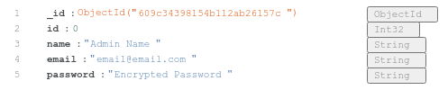 | 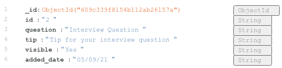 |  |
| ----------------------------------- | --------------------------------------- | -------------------------------------- |

<br>

## Testing

<br>

## Debug Logging

The application has been designed with debugging in mind. In your main application folder, you will find a file called `logs.log` which will contain similar information as below:

```
2021-05-12 21:13:12,267 INFO     Main application has been initialized!
2021-05-12 21:13:12,364 INFO     MongoDB Connected successfully!
2021-05-12 21:13:12,743 INFO     MongoDB Server version: 4.4.6
2021-05-12 21:13:12,759 INFO     MongoDB Text Search index has already been created... skipping.
2021-05-12 21:13:12,781 INFO     Database 'TheInterviewMasterDeck' detected in MongoDB!
2021-05-12 21:13:12,785 INFO      * Running on http://0.0.0.0:5000/ (Press CTRL+C to quit)
2021-05-12 21:18:24,160 INFO     127.0.0.1 - - [12/May/2021 21:18:24] "GET / HTTP/1.1" 200 -
2021-05-12 21:18:26,403 INFO     127.0.0.1 - - [12/May/2021 21:18:26] "GET /start HTTP/1.1" 200 -
2021-05-12 21:18:35,912 INFO     127.0.0.1 - - [12/May/2021 21:18:35] "GET /admin HTTP/1.1" 200 -
2021-05-12 21:18:35,930 INFO     127.0.0.1 - - [12/May/2021 21:18:35] "GET /static/admin_main.css HTTP/1.1" 304 -
2021-05-12 21:18:36,009 INFO     127.0.0.1 - - [12/May/2021 21:18:36] "GET /static/images/wallpaper.jpg HTTP/1.1" 200 -
2021-05-12 21:18:56,733 INFO     Admin Login attempt successful
2021-05-12 21:18:56,753 INFO     127.0.0.1 - - [12/May/2021 21:18:56] "POST /admin HTTP/1.1" 200 -
2021-05-12 21:18:58,616 INFO     127.0.0.1 - - [12/May/2021 21:18:58] "GET /admin_cards HTTP/1.1" 200 -
2021-05-12 21:19:01,974 INFO     127.0.0.1 - - [12/May/2021 21:19:01] "GET /admin_card_update/11 HTTP/1.1" 200 -
2021-05-12 21:19:05,471 INFO     Questions Card has been deleted successfully
2021-05-12 21:19:05,472 INFO     127.0.0.1 - - [12/May/2021 21:19:05] "GET /admin_card_delete/609855be0f54ae446426e983 HTTP/1.1" 302 -
2021-05-12 21:19:05,518 INFO     127.0.0.1 - - [12/May/2021 21:19:05] "GET /admin_cards HTTP/1.1" 200 -
```

## Bug Testing (Site functionalities)

### Test 1 - Browser & Device Compatibility

- Main App has been tested with:
  - Chrome on Android
  - Safari on iOS
  - Microsoft Edge for Linux, Chrome & Firefox on Desktop
- Admin Page
  - Chrome on Android
  - Safari on iOS
  - Microsoft Edge for Linux, Chrome & Firefox on Desktop

### Test 3 - Errors at parsing HTML & CSS

- Website has been tested at https://validator.w3.org/nu/ & https://jigsaw.w3.org/css-validator/ and showing no errors related to the app
- https://jigsaw.w3.org/css-validator/ shows CSS errors specifically for external dependencies, which I can't resolve on my own

### Test 4 - End User Flow

1. Navigate to App URL (http://the-interview-master-deck.herokuapp.com/ for example)
2. Test swipe left:  
   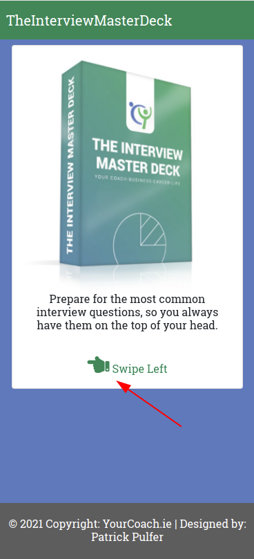
3. Click on Start:  
   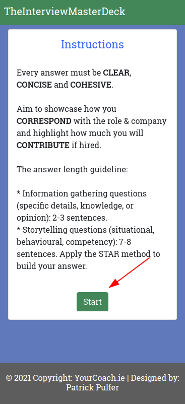
4. Swipe a few cards to the left and observe Cards being sorted randomly
5. Click on "Search" button:  
   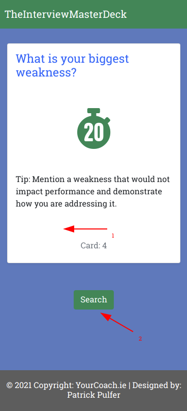
6. Enter a keyword in the text box, in this case "leaving" and click "Search:"  
   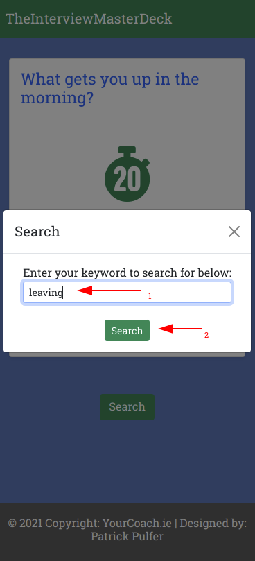
7. Observe all cards being displayed with the selected word "leaving":  
   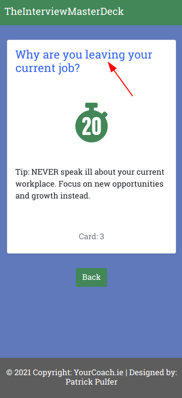

### Test 5 - Admin Login Flow

1. Navigate to the Admin Portal (http://the-interview-master-deck.herokuapp.com/admin as example)
2. Enter your admin credentials created earlier during setup (Admin:SuperSecret123! for the demo) and click Login:  
   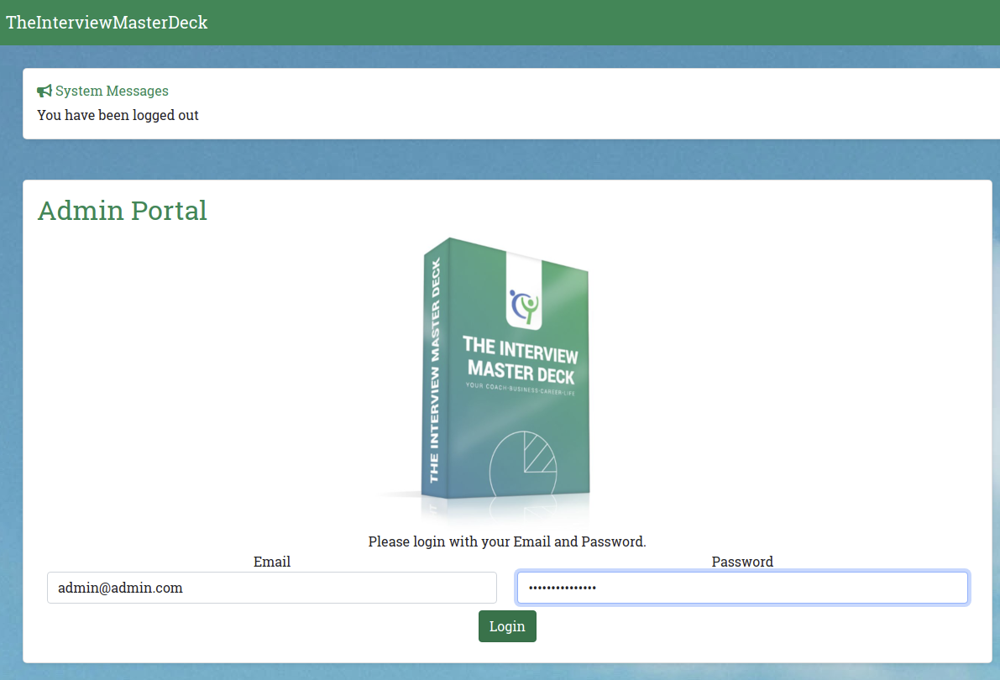
3. Observe login being successfully and Python Flash displaying the following message:  
   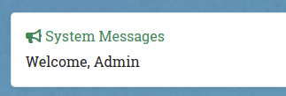

### Test 6 - Admin Question Cards Creation and Deletion Flow

1. You should be logged into the Admin Portal
2. Click on "Cards" in your top navigation bar
3. On the right side of the screen, we will enter a test interview question as shown below:  
   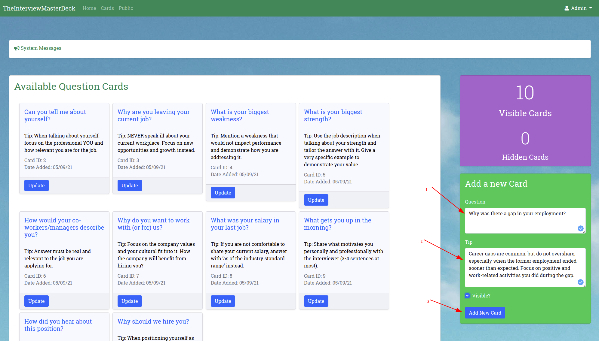
4. After entering a test interview question, tick the box "Visible?" and then click "Add New Card"
5. Observe the Python Flash message about the card creation and the new Interview Question Card appearing at the bottom of the list as shown below:
   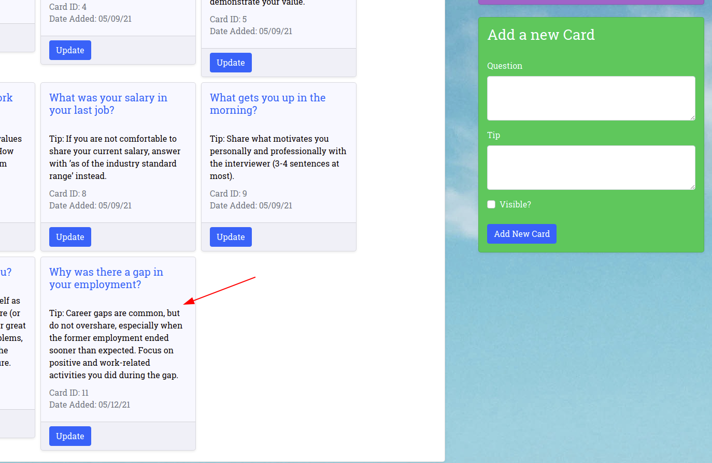
6. Now on your mobile phone, navigate to the end user page (http://the-interview-master-deck.herokuapp.com/start), swipe through a few Interview Question Cards and observe if the new question does appear as shown below:  
   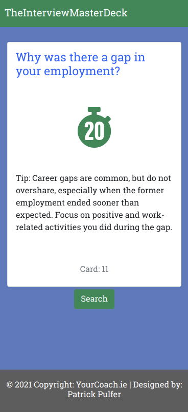
7. Back in your Admin Portal, click on "Update" button on the newly created Interview Question Card. You should now see a new page as shown below:
   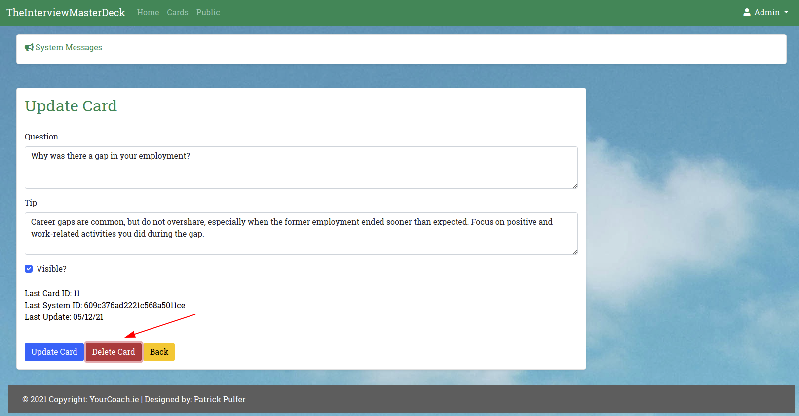
8. On this screen, click on "Delete Card". You should see a confirmation asking if you really want to delete the Interview Question Card. Click "OK":  
   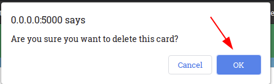
9. Once confirming, you should be re-directed to the Cards Management Page. Observe the deleted card missing and Python Flash message informing on the action as shown below:  
   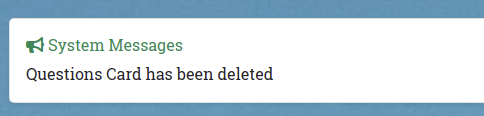

Note: If you have access to `logs.log`, you can to see the workflow being reflected in the debug logging"
<br>

### Additional testing

To test the update Interview Question Card functionality, you may click on "Update" of an Interview Question Card, change the text and click "Update". Once back at your Card Management page, you should see the particular question being altered.

<br>

### User Story testing

Stakeholder, Administrator:  
  
1. Stakeholder has tested the app herself and noted it was easy to navigate (each page said what to do)
2. Stakeholder has observed that cards were similar to the physical card deck available
3. Stakeholder has observed that cards within the app were displaying a tip underneath of the actual query
4. Stakeholder has observed that cards were displayed randomly (card ID are displayed on each card) 
5. Stakeholder has observed search field would search based on keywords of the cards

"Ability for the admin to store, add, hide, edit and delete Question Cards safely without other external interference"
- Stakeholder has logged into the admin site and advised 

"No user data should be recorded. Personal preferences or log in should not be required"
- Stakeholder has noted there is no tracking feature as desired


## Feedback from Stakeholders

### Aggie, yourcoach.ie

- _"I am very happy with the result! I am ready to recommend, and use this app as a supporting tool for my coaching practices. The Admin Portal is very easy to navigate through so no training required for me!"_

### End User 1

- _"Simple, does what I would want and no adds"_

### End User 2

- _"This is perfect! An app I'm not afraid to use because it does not distract me. Linking/Bookmark specific questions is a plus!!!"_
