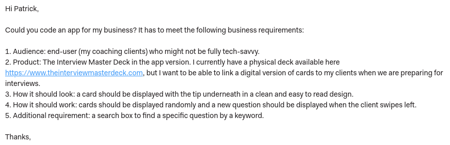
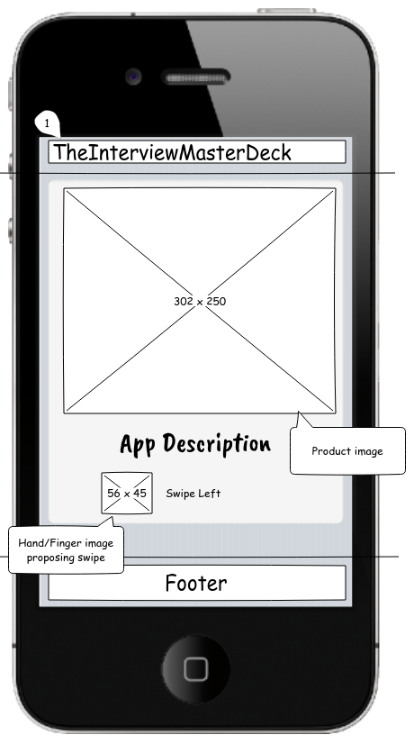
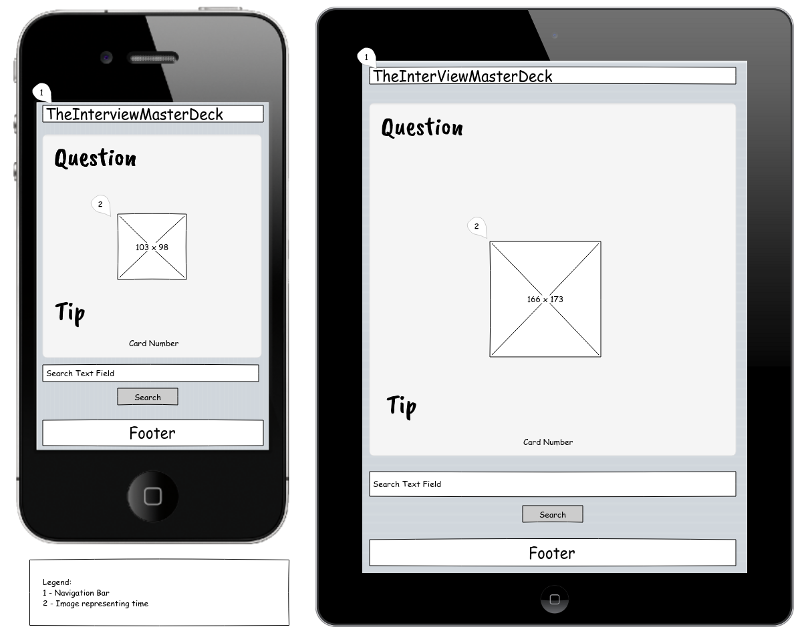
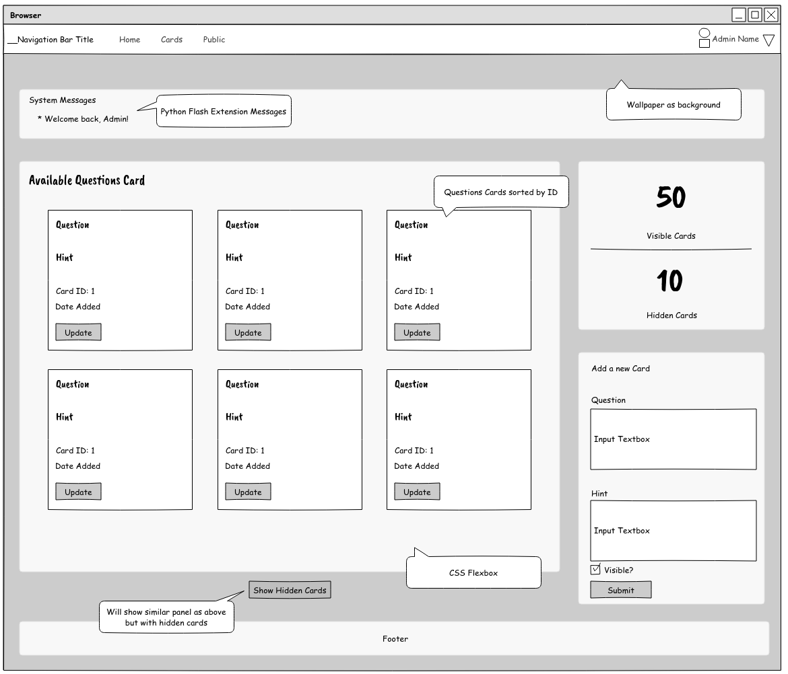

## Project Requirements for Code Institute Full-Stack Software Development Diploma

- MongoDB-backed Python Flask application with web interface that allows users to store and manipulate data records about a chosen domain.
- CRUD functionality and database structure that is suited for the required domain  
   

## My approach

- I have taken inspiration from a real-life business requirement at yourcoach.ie to design a functional mobile application
- In this document, I will attempt to explain the process I went through in thinking, planning and developing this project by utilizing industry-standard methodologies.

 

# UX Design

 
For this project, I've adopted the methodology of the five planes of UX, which cosist of:

- Strategy
- Scope
- Structure
- Skeleton
- Surface Design

> “The Elements of User Experience” book written by Jesse James Garrett, one of the founders of Adaptive Path, a user experience consultancy based in San Francisco.

 

## Strategy

### User Stories & Requirements

- Stakeholder, Administrator:  
  

- Additional request from stakeholder after initial request:

  - Ability for the admin to store, add, hide, edit and delete Question Cards safely without other external interference
  - No user data should be recorded. Personal preferences or login should not be required.

- Stakeholder, End User:
  - I have consulted with a few end users that are not tech-savy and the following trend emerged
    - _"I want to perform actions with the least clicks necessary"_
    - _"I want no distractions, adds or having to login anywhere!"_

 

### Scope of this Project (based on admin and end user requirement/story)

- To create a website that is responsive on mobile, tablet, laptops and desktops
- To create a website with uncluttered, logical and intuitive navigation which is easy to follow
- To store, manipulate, edit and delete (CRUD) data in a secure database, in this case MongoDB
- To create an app (website) written in Python Flask, ready to be deployed to Heroku

 

### Structure

- End User Page (Mobile first, desktop after)

  - Top:
    - A navigation bar with Title which is adapted to the user (admin has links to cards management page while end user has only a title)
  - Central:
    - Interview Questions Card is presented with Question, a graphic and Tip. A search box and submit button is shown below the card. I have decided to include swipe.js to allow user to swipe between cards ("tinder") style instead of traditional "Next" & "Back" buttons. Also the cards are displayed in random order on each loading.
  - Bottom:
    Simple footer displaying Copyright and Credit of the app creator

- Admin Page (Desktop first, mobile after)
  - Top:
    - A navigation bar with Title and links to administrative functionalities, like Questions Card Management. Admin will also be able to terminate the session with Logout button
  - Central:
    - Central is mostly divided into 3 sections: Top section will display system messages generated by Python Flash extension. The Main section will allow main functionalities like Card Updates and Deletion. This is also where the admin does login. Right side will display statistics like number of visible cards and also quick functionality like adding a new Question Card
  - Footer:
    - Footer will display the Copyright and the credits for the app creator

 

### Skeleton

To be adhere to the structure outlined above, the following wireframes were drafted:

- End User Welcome Screen  
  

- End User Questions Card Screen  
  

- Admin Panel Screen  
  

As an important note, we want to draw the eyes to the middle of the screen.

 

### Surface Design

To emphasize the origin of the project and the company behind it, decision was made to include the color scheme that would best match the colors in the existing logo:

- 

Color pallet:

- Main Color (buttons & titles):  #438657
- Main background: #547dbe
- Blue Title (buttons & titles): #3A63F8
- Footer Background: #5d5d5d

 

## Testing

 

## Bug Testing (Site functionalities)

### Test 1 - Browser Compatibility

### Test 2 - Device Compatibility

### Test 3 - Errors at parsing HTML level

### Test 4 - Errors at anchoring level

### Test 5 - Errors at form level

### Report

- After several testing periods, end users have provided positive feedback.
   

## User Story / Feature Testing
